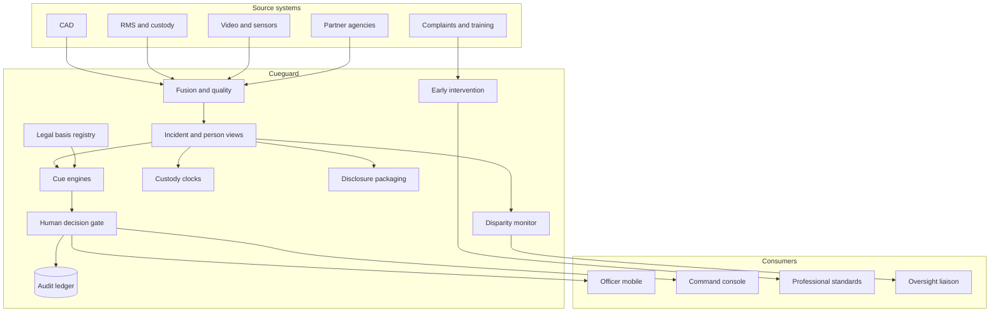

# Cueguard

**Source:** `ai-in-gov/Accenture-Digital-Policing-Powered-by-Analytics/`
**Domain:** `ai-gov`
**One-liner:** A policing analytics platform that gives command and officers a single, timely operational picture — with mandatory human decision gates, early-intervention on officer conduct, and civil-liberties controls on predictive cues.
**Wedge:** Mid-to-large municipal and regional police services drowning in siloed CAD, RMS, body-worn video metadata, and complaints systems — starting with officer early-intervention and domestic-violence location history before any predictive “hotspot” productisation.
**Positioning:** Safeguarded operational intelligence, not predictive policing as a black box. Accenture’s brief sells a technology-agnostic analytics platform for early intervention, officer enablement, and citizen protection; Cueguard makes audit trails, legal basis, intelligence-vs-evidence separation, and human decision-making first-class — because without them community trust collapses.

## Market research synthesis

### Thesis from source

The Accenture brief argues that big data is disrupting policing the way the internet did: 89% of surveyed respondents said big data will revolutionise operations similarly. Analytics is therefore a priority because officers need accurate, timely information for real-time field decisions; agencies must track citizen feedback to build trust; and intelligence-led policing depends on proactive deployment of scarce resources. Awareness is high — 90% of global public service technology leaders know advanced analytics, and of those, 71% are piloting or implementing — yet police agencies still lag at exploiting data. US police chiefs in Accenture’s survey named better use of analytics as a priority while admitting they lack understanding of how to drive operations with it.

The brief names four data failures that define the product: **fragmented** siloed internal and partner data requiring manual compilation; **unauditable** decision trails when officers cannot show they followed protocols; **inaccurate** duplicates and incomplete identities that destroy confidence; and **untimely** data that arrives after decisions — e.g., responding to domestic violence without the location’s history. Citizens expect partnership: 96% said the public should play a role in police services, and 79% want digital interaction as well as face-to-face; more than 80% believe advanced digital tools can support police work.

Three outcome pillars structure the platform: **Intervene early** (Seattle consolidating calls, incidents, civilian interactions, use-of-force, admin processes, and training to surface officer activity outside peer norms before crises); **Enable officers** (West Midlands mobile transformation to increase patrol time; real-time handheld insight); **Protect citizens** (London Met gang-violence predictive pilot across 32 boroughs; Lille video analytics when a street market swells from 230,000 to 2.5M people). Seattle Chief Kathleen O’Toole’s quote anchors the trust thesis: an integrated platform enhances operations and accountability, improving effectiveness and bolstering public confidence. Cueguard productises that platform with explicit civil-liberties machinery the brochure implies but does not engineer: legal basis tags, custody time-limit clocks, disclosure packages, disproportionality monitors, and a ban on automated liberty-affecting decisions.

### Buyer & economic model

- **Primary buyer:** Police chief / commissioner with CIO and head of professional standards (early intervention) as co-sponsors; sometimes a regional collaboration board.
- **Users:** command staff, dispatch supervisors, frontline officers (mobile), analysts/intel units, professional standards / early-intervention units, custody sergeants, disclosure/discovery officers, community oversight liaisons, data protection officers.
- **Budget owner / value metric:** public-safety IT and professional-standards budgets. Value metrics: time-to-relevant-history on priority calls; share of decisions with complete audit trail; early-intervention cases opened before serious misconduct; officer minutes spent seeking information vs on scene; complaint and use-of-force trend transparency.
- **Competing status quo:** multiple on-prem silos, spreadsheet fusion cells, vendor-specific predictive tools without audit or legal-basis metadata, and after-the-fact IA investigations instead of early intervention.

### Domain constraints

- **Regulatory / trust / safety:** lawful basis for law-enforcement processing; distinction between intelligence and evidential material; disclosure duties to defence; custody time limits; oversight bodies and complaints; predictive policing controversy and requirement that humans — not models — make liberty-affecting decisions; disproportionality and community trust monitoring; purpose limitation when sharing with partner agencies.
- **Data sensitivity:** criminal records, victim/witness data, juvenile data, biometrics and video, officer HR/complaints data (especially sensitive inside early-intervention), partner-agency feeds.
- **Change-management realities:** officers will not use data they do not trust; chiefs want analytics but lack operating models; community legitimacy requires transparency about what cues are shown and that predictions never arrest someone alone.

## Business requirements

- BR-1: For every priority incident type configured (starting with domestic violence), officers must receive location and person-risk history before or on arrival, with data-age and source labels.
- BR-2: Every operational cue presented to an officer or commander must carry a recorded legal basis and a human decision capture — accept, modify, or reject — before it can be treated as an action instruction.
- BR-3: Predictive scores may inform deployment planning but must never automatically create arrests, stops, or custody actions; the UI must forbid one-click “execute prediction.”
- BR-4: Intelligence products and evidential packages must be separable, with disclosure export that meets defence disclosure duties without dumping raw unevaluated intelligence.
- BR-5: Early-intervention must surface officer activity outside peer-group norms across use-of-force, complaints, and related events, with professional-standards ownership and due-process for the officer.
- BR-6: Audit trails must show what data an officer saw and when, sufficient to reconstruct whether protocols were followed.
- BR-7: Data quality controls must detect duplicate identities and incomplete addresses before fusion into a “single view,” and must show confidence to the user.
- BR-8: Partner-agency sharing must be purpose-bound and logged; receiving a feed does not grant secondary use without a new basis.
- BR-9: Custody modules must respect custody time limits with escalating alerts to custody supervisors.
- BR-10: Disproportionality dashboards by demographic and geography must be available to command and oversight, not only to vendors.
- BR-11: Citizen digital contact history may personalise non-coercive service responses but must not silently raise suspicion scores without a documented investigative predicate.
- BR-12: Commercial terms must allow technology-agnostic source connectors and prohibit lock-in that prevents swapping a model or source system — matching the brief’s “technology agnostic” requirement.

## User stories

Canonical user stories live in sibling [USER_STORIES.md](USER_STORIES.md).

## System design

### Overview

Cueguard consolidates law-enforcement and partner sources into a governed analytics plane. Fusion produces incident and person views with quality confidence. Cue engines generate early-intervention alerts, deployment suggestions, and vulnerability/hotspot cues — each tagged with legal basis. Officers and command act only through human decision capture. Custody clocks, disclosure packaging, and disproportionality monitoring run as peer capabilities. Audit logs bind what was seen to what was decided.

### Actors & boundaries

- **Actors:** officers, command, analysts, professional standards, custody, disclosure, oversight, partner agencies, data protection.
- **Trust boundary:** evidential vault vs intelligence store; officer HR/EI data highly restricted; partner feeds ingress with purpose tags; model vendors see features not raw case files where avoidable.
- **Human-in-the-loop points:** all liberty-affecting actions; acceptance/rejection of predictive cues; EI case opening; disclosure package approval; model purpose registration.

### Core capabilities

1. **Source fusion and single incident view** — CAD/RMS/video/partner connectors with quality confidence.
2. **Officer enablement briefs** — timely history packs for priority call types.
3. **Early intervention** — peer-norm monitoring and professional-standards workflows.
4. **Predictive cues with decision gates** — deployment/vulnerability suggestions; no automatic coercion.
5. **Legal basis and purpose registry** — model and feed registration.
6. **Intelligence vs evidence separation** — dual stores and disclosure export.
7. **Custody time-limit management** — clocks and escalations.
8. **Audit trail and protocol reconstruction** — what was shown/when/decided.
9. **Disproportionality and trust monitoring** — command/oversight dashboards.
10. **Citizen contact context** — non-coercive service personalisation with predicate rules for investigative use.

### Conceptual data

- **Primary entities:** Agency, SourceSystem, IncidentView, PersonEntity, LocationProfile, OfficerProfile, Cue, LegalBasisRecord, HumanDecision, EarlyInterventionCase, CustodyDetention, EvidencePackage, IntelligenceProduct, AuditEvent, DisparityMetric, PartnerShareGrant, ModelRegistration.
- **Critical events:** source ingested, view materialised, cue issued, human decision recorded, EI case opened/challenged, custody clock breached warning, disclosure package sealed, disparity threshold breached.
- **Retention / audit needs:** audit events and human decisions retained for complaints, disclosure, and oversight windows; predictive features retained with model version for challenge; EI officer data stricter retention and access.

### Integrations (conceptual)

- **Systems of record:** CAD, RMS, custody, evidence management, IA/complaints, training HR, body-worn video indexes, courts/prosecutor disclosure channels.
- **Upstream signals:** ANPR/LPR where lawful, video analytics alerts, open-source and partner feeds, citizen digital reports.
- **Downstream actions:** officer mobile brief push, command tasking, EI coaching cases, custody alerts, disclosure bundles, public transparency aggregates.

### High-level architecture

### Success metrics

- **Leading:** % priority calls with history pack before arrival; median data age of fused fields; cue human-decision rate; EI flags opened within policy SLA; custody clock warning compliance; audit completeness on sampled decisions.
- **Lagging:** reduction in information-seeking time on scene; sustained or improved community trust/complaint trends; misconduct caught pre-crisis via EI; disclosure timeliness; measured reduction in disproportionality where actionable; officer confidence-in-data scores.

## OpenAPI skeleton

Canonical HTTP surface lives in sibling [openapi.yaml](openapi.yaml). Summary:

- **Base path:** `/v1/...`
- **Auth:** `X-API-Key` for source connectors; Bearer JWT for officers and command (role-scoped).
- **Resource groups:** Incidents, Cues, Decisions, EarlyIntervention, Custody, Disclosure, Governance.
