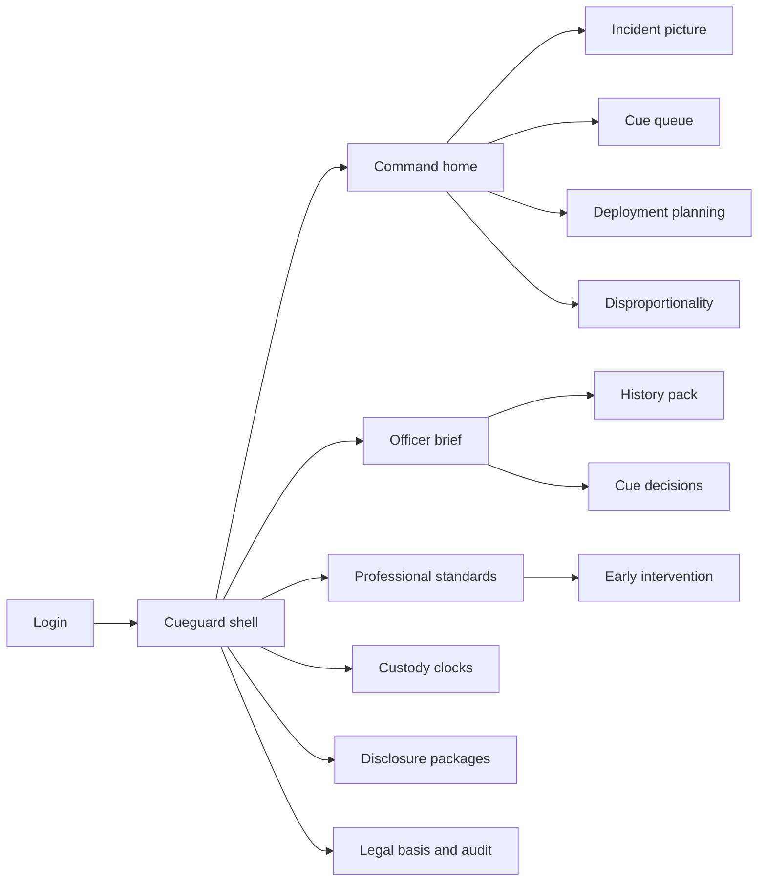
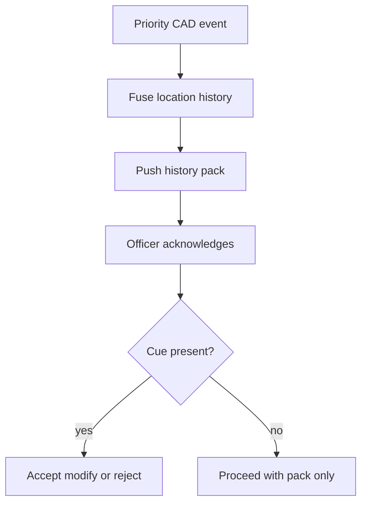

# Cueguard — Web app

**Product:** [PRODUCT.md](./PRODUCT.md)
**Primary surface:** Command and professional-standards console (with officer mobile brief as first-class companion)
**Secondary surfaces:** Officer mobile history pack; oversight read-only audit excerpts; disclosure package export viewer
**Design thesis:** Cueguard is a safeguarded ops floor, not a predictive-policing arcade. The UI metaphor is a duty-desk briefing board: every cue arrives with a legal-basis stamp and a human decision slot — accept, modify, or reject — before it can become an instruction. Visual language is night-ops graphite and signal amber on a deep navy ground; custody clocks and early-intervention flags use unmistakable escalation chrome, while predictive scores stay visually subordinate to human decision capture. The Cueguard wordmark sits as a quiet accountability mark on every cue and audit screen so commanders and oversight know whose trail they are reconstructing.

## UX research synthesis

### Category peers (best-in-class)

- **Axon Records / Axon Standards:** Incident-centric records with body-worn linkage and early-intervention adjacent workflows. Steal: officer-facing clarity and due-process framing for conduct flags; reject scoreboard gamification of force metrics.
- **Mark43 CAD/RMS:** Fast incident timelines and unit status density for command. Steal: single incident picture and time-to-context; reject burying legal basis in admin-only tabs.
- **Palantir Gotham (LE deployments) / equivalent fusion UIs:** Cross-source entity resolution with confidence. Steal: source labels and confidence on fused fields; reject opaque “entity score” as arrest authority.
- **UK College of Policing / NPCC custody & disclosure practice UIs (conceptually):** Custody clocks and unused-material discipline. Steal: intelligence-vs-evidence separation and disclosure packaging as first-class nav, not afterthought exports.

### Patterns to adopt / reject

- **Adopt:** History pack before arrival for priority call types; legal basis + human decision on every cue; hard UI ban on one-click “execute prediction”; EI peer-norm outliers with PS ownership and challenge path; custody time-limit escalations; disclosure packages distinct from intel products; disproportionality views for command/oversight; purpose-bound partner shares.
- **Reject:** Hotspot heatmaps as the home screen; automated stop/arrest from model output; citizen contact history silently raising suspicion without predicate; rainbow KPI tiles; purple “AI copilot” that writes charging language; editable audit trails.

### Trust, density, and workflow constraints from PRODUCT.md

Frontline trust collapses if data is late, duplicate, or unauditable (BR-1, BR-6, BR-7): show data-age, source, and confidence; never present a false “single view” without quality warnings. Liberty-affecting actions stay human-gated (BR-2, BR-3). Officer EI data is highly sensitive — role-gated and due-process first (BR-5). Partner feeds do not imply secondary use (BR-8). Oversight gets read-only excerpts without operational compromise. Technology-agnostic connectors must be visible in governance so model/source lock-in is hard to hide (BR-12).

## Information architecture

### Nav model

### Roles → default home

| Role | Default home | Why |
|------|--------------|-----|
| Frontline officer | Officer brief — priority history pack | Timely field decisions (BR-1) |
| Dispatch supervisor / command | Command home — incident picture | Resource allocation without manual fusion |
| Early-intervention / PS analyst | Early intervention queue | Coach before crisis (BR-5) |
| Custody sergeant | Custody clocks | Time-limit compliance (BR-9) |
| Disclosure / discovery officer | Disclosure packages | Evidence ≠ intelligence (BR-4) |
| Data protection / oversight liaison | Governance and audit excerpts | Defensible processing (BR-10) |
| Intel analyst | Cue queue + model registry | Purpose and basis on record |

### Cross-links to OpenAPI resources

| Nav area | OpenAPI tags / resources |
|----------|---------------------------|
| Incident picture / history packs | Incidents |
| Predictive / vulnerability cues | Cues |
| Accept / modify / reject | Decisions |
| Peer-norm EI cases | EarlyIntervention |
| Detention clocks | Custody |
| Evidence package export | Disclosure |
| Legal basis, models, partner shares, audit | Governance |

## Screen inventory

### Command home

- **Purpose:** One operational picture across CAD/RMS/video alerts with cue and disparity alerts — not a predictive heatmap as the hero.
- **Entry:** Command login default.
- **Layout regions:** Brand + agency switcher; active priority incidents table; fusion health (untimely/incomplete sources); open cues awaiting human decision; disparity threshold alerts; custody breach warnings strip.
- **Primary actions:** Open incident; assign resources; jump to undecided cues; open disparity drill-down.
- **Empty / loading / error:** Empty shift = calm “no priority incidents”; source outage = coral banner with last-good age.
- **BR / story ties:** Command stories; BR-1, BR-7, BR-10.

### Incident picture

- **Purpose:** Fused incident and location/person context with quality confidence and source labels.
- **Entry:** From command home, CAD deep link, or officer brief.
- **Layout regions:** Timeline (CAD → RMS → video alerts); location history panel; person entities with duplicate warnings; confidence chips; partner-share purpose tags; audit “what you are seeing” footer.
- **Primary actions:** Push history pack to unit; open cue; request better identity resolution; seal note to audit.
- **Empty / loading / error:** Incomplete address = warning before “single view” claim; duplicate identity = force resolve or proceed with acknowledged risk.
- **BR / story ties:** BR-1, BR-6, BR-7.

### Officer history pack (mobile-first)

- **Purpose:** Location and person-risk history for configured priority types (start: domestic violence) before/on arrival.
- **Entry:** Push on unit assign; officer home.
- **Layout regions:** Call header; data-age and sources; prior incidents at location; caution markers; optional cue with decision controls; offline-capable last pack cache notice.
- **Primary actions:** Acknowledge pack; accept/modify/reject cue; mark protocol step complete.
- **Empty / loading / error:** No history = explicit “none on record” with age of search; stale pack = amber refresh.
- **BR / story ties:** BR-1, BR-2; frontline stories.
- **Mobile notes:** Primary officer surface; large tap targets; works on handheld with intermittent connectivity.

### Cue decision gate

- **Purpose:** Present every operational cue with legal basis and force human accept / modify / reject before it becomes instruction.
- **Entry:** Cue queue; incident; officer pack.
- **Layout regions:** Cue summary; model/purpose registration link; legal basis stamp; score visually demoted; decision panel with reason codes; forbidden state if UI would imply auto-arrest.
- **Primary actions:** Accept; modify parameters; reject with reason; escalate to command.
- **Empty / loading / error:** Missing legal basis = cannot present as actionable; BR-3 guardrail copy when user attempts coercive shortcut.
- **BR / story ties:** BR-2, BR-3.

### Deployment planning (cues subordinate)

- **Purpose:** Use predictive/vulnerability suggestions for resource planning without coercive automation.
- **Entry:** Command → Deploy.
- **Layout regions:** Suggested deployment map/list; human tasking board; cue decisions required before task publish; no “execute prediction” control.
- **Primary actions:** Publish human tasking; reject cue set; compare prior period disparity impact.
- **Empty / loading / error:** Model unregistered = block suggestions.
- **BR / story ties:** BR-3, BR-10.

### Early intervention queue

- **Purpose:** Surface officer activity outside peer norms across complaints, use-of-force, and related events with PS ownership.
- **Entry:** PS default home.
- **Layout regions:** Outlier queue; peer-norm context charts; case drawer with due-process checklist; officer challenge evidence pane; strict access banner.
- **Primary actions:** Open coaching case; assign PS owner; accept challenge; close with outcome.
- **Empty / loading / error:** Empty = within-norm message; erroneous fusion challenge path always visible on open cases.
- **BR / story ties:** BR-5; PS stories.

### Custody clocks

- **Purpose:** Detention time limits with escalating alerts to custody supervisors.
- **Entry:** Custody nav; command alert strip.
- **Layout regions:** Active detentions table; countdown clocks; escalation ladder; linked incident/person.
- **Primary actions:** Acknowledge warning; extend only via lawful workflow; notify supervisor.
- **Empty / loading / error:** Clock sync failure = coral blocking state.
- **BR / story ties:** BR-9.

### Disclosure packages

- **Purpose:** Export evidential packages distinct from intelligence products for defence disclosure duties.
- **Entry:** Disclosure nav; case file.
- **Layout regions:** Evidence vault items vs intel store (visually separated); package builder; seal/approve; unused-material log; export formats.
- **Primary actions:** Add evidence; exclude intel; seal package; send to disclosure channel.
- **Empty / loading / error:** Attempt to drag raw intel into evidence package = blocked with explanation.
- **BR / story ties:** BR-4.

### Disproportionality monitor

- **Purpose:** Demographic and geographic disparity views for command and oversight — not vendor-only.
- **Entry:** Command/oversight nav.
- **Layout regions:** Metric selectors (stops, force, cues accepted); geography; threshold breaches; drill to policy response tasks (not individual targeting).
- **Primary actions:** Open threshold incident review; export oversight pack; compare periods.
- **Empty / loading / error:** Insufficient denominator = suppress misleading rates with explanation.
- **BR / story ties:** BR-10.

### Governance: legal basis, models, partners, audit

- **Purpose:** Register model purposes and legal bases; purpose-bind partner shares; reconstruct what was seen/decided.
- **Entry:** DPO/oversight; admin.
- **Layout regions:** Model registry; feed purpose grants; audit search (officer, incident, cue); connector inventory proving swappable sources (BR-12); citizen-contact predicate rules.
- **Primary actions:** Register model; grant/revoke partner purpose; export audit excerpt; attest connector agnosticism.
- **Empty / loading / error:** Unregistered model cannot issue cues.
- **BR / story ties:** BR-6, BR-8, BR-11, BR-12.

## Key flows

1. **Domestic-violence arrival brief** — priority CAD event → fuse location history → push pack with age/sources → officer acknowledges → optional cue decision; failure: incomplete identity shown with confidence warning (BR-1, BR-7).

2. **Cue to human decision** — cue issued with legal basis → officer/command decides → audit bind; failure: missing basis blocks actionable presentation (BR-2).

3. **Early-intervention case** — peer-norm outlier → PS opens case → officer may challenge → coaching outcome; failure: analytics-as-punishment blocked by due-process checklist (BR-5).

4. **Disclosure seal** — select evidential items → exclude intel → seal package → export; failure: intel dump attempt blocked (BR-4).

5. **Custody limit escalation** — detention open → warning thresholds → supervisor alert → breach state if unresolved (BR-9).

## Design system

### Tokens (CSS variables)

- `--color-ink: #E6EEF5` — primary text
- `--color-navy-950: #0A121C` — app ground (night ops)
- `--color-navy-900: #121C2A` — panels
- `--color-navy-700: #2A3D52` — rules
- `--color-signal: #F0A202` — cue attention / custody warning
- `--color-ok: #3DDC97` — decision recorded / pack fresh
- `--color-coral: #E85D4C` — breach / blocked coercive action
- `--color-steel: #8AA0B5` — secondary labels
- `--color-brand: #A8C5D9` — Cueguard wordmark (quiet steel-blue)
- `--font-display: "Barlow Condensed", sans-serif` — incident titles and clocks
- `--font-body: "IBM Plex Sans", sans-serif`
- `--font-mono: "IBM Plex Mono", monospace` — incident ids, legal-basis codes
- `--space-1`…`--space-8`: 4px scale
- `--radius-sm: 4px`; `--radius-md: 6px` — utilitarian ops, not soft consumer
- `--motion-clock: 150ms linear` — custody tick emphasis
- `--motion-cue: 220ms ease-out` — cue arrival
- `--motion-decide: 180ms ease-in` — decision stamp
- Atmosphere: subtle scan-line / grid duty-board texture; no crime-scene stock photos; no neon “cybercrime” glows.

### Typography & brand

- Condensed display for clocks and incident codes; body for narrative history; mono for basis and audit ids.
- Brand on every cue and audit view; officer mobile shows compact mark + “human decision required” when cues present.
- Login: brand hero; headline (“Cues inform. Humans decide.”); one CTA — no hotspot hero map.

### Do / don’t

- **Do:** Legal-basis stamp on cues; demote predictive scores visually; separate intel/evidence panes; show data-age always; due-process on EI.
- **Don’t:** One-click arrest from prediction; purple AI glow; citizen service history as silent suspicion; heatmap-as-home; editable audits; emoji status.

### Accessibility & domain trust cues

- AA+ contrast on signal/coral against navy; custody warnings use text + icon + optional haptics on mobile.
- Live regions for custody escalations and cue arrivals.
- Focus order: incident → pack → decision → audit.
- Oversight excerpts watermarked read-only with redaction notices.

## Component patterns

- **HistoryPackCard** — location/person history with data-age and sources.
- **LegalBasisStamp** — immutable basis code on cues and shares.
- **HumanDecisionPanel** — accept / modify / reject with reason codes.
- **CueScoreDemoted** — score shown secondary to decision controls; no execute CTA.
- **CustodyClock** — escalating thresholds to breach.
- **IntelEvidenceSplit** — dual-pane stores for disclosure building.
- **EiDueProcessChecklist** — PS case steps + officer challenge.
- **DisparityThresholdBanner** — command/oversight alert without targeting individuals.
- **AuditSeenRail** — what data was shown, when, and decided.

## Out of scope for v1 web

- Court case-management replacement; full body-worn video editing suite; public citizen crime-map app; automated facial-recognition gallery browser as a product surface; vendor model training UI; national CLETS/PNC administration consoles beyond connector status.
